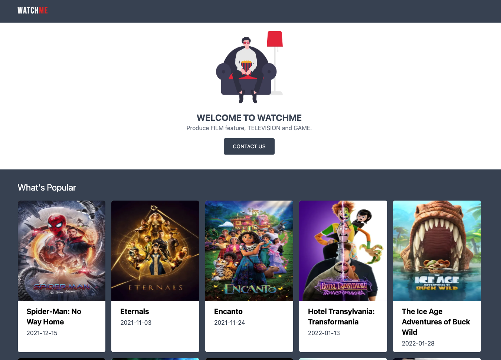

This is a [Next.js](https://nextjs.org/) project bootstrapped with [`create-next-app`](https://github.com/vercel/next.js/tree/canary/packages/create-next-app).

## Available Scripts

Before start, you need to create a <b>.env</b> file with API_KEY key related to: https://www.themoviedb.org/settings/api
Example: "API_KEY="15af2ad4e9115dd3a1d9f8181268edf0""

In the project directory, you can run:

### `npm install`

Instal All dependencies in this project

### `npm dev`

Runs the app in the development mode. 
Open [http://localhost:3000](http://localhost:3000) to view it in the browser.

### Tools used in the project

- Next js: https://nextjs.org/docs/getting-started
- TailwindCSS: https://tailwindcss.com/docs/guides/nextjs
- Themoviedb: https://www.themoviedb.org/
- Themoviedb Docs: https://developers.themoviedb.org/3
- font family: https://fonts.google.com/specimen/Bebas+Neue
- illustration: https://undraw.co/search

